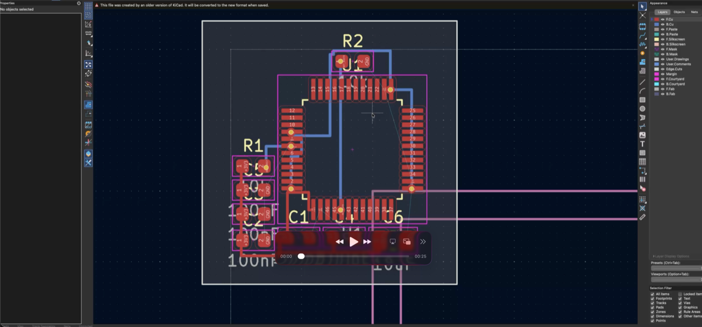
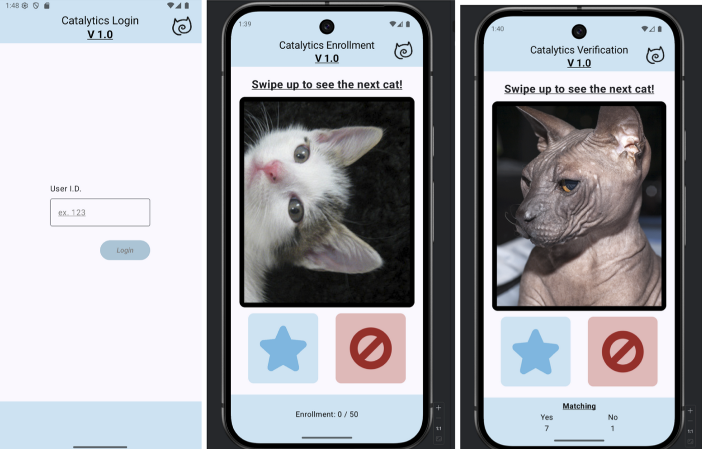
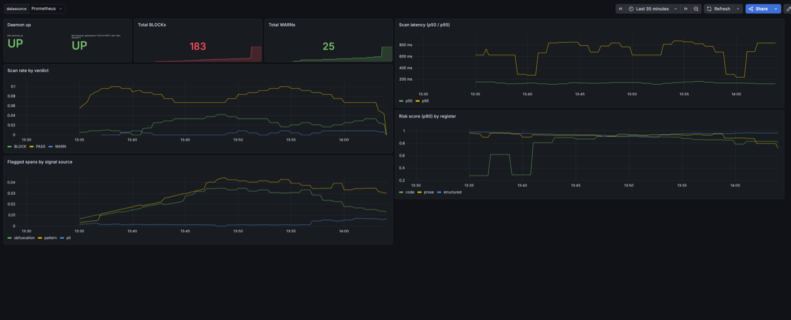
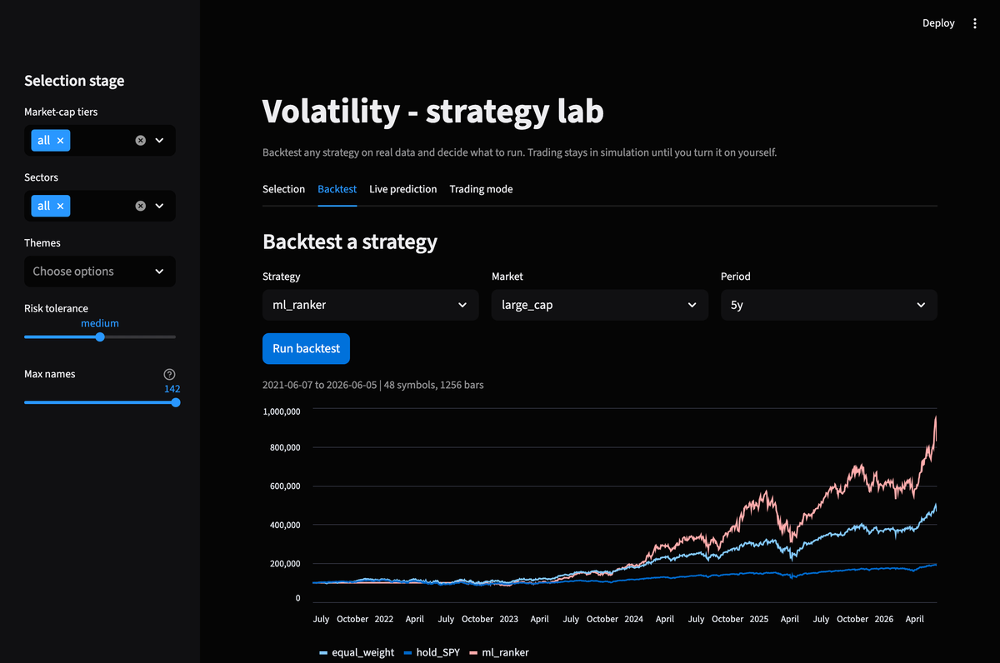
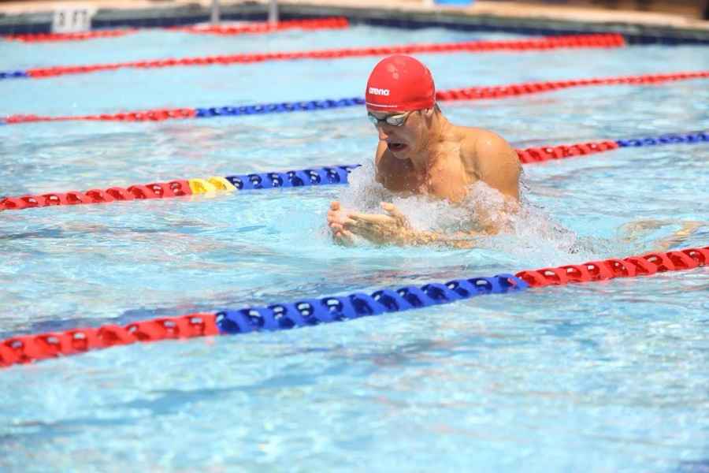
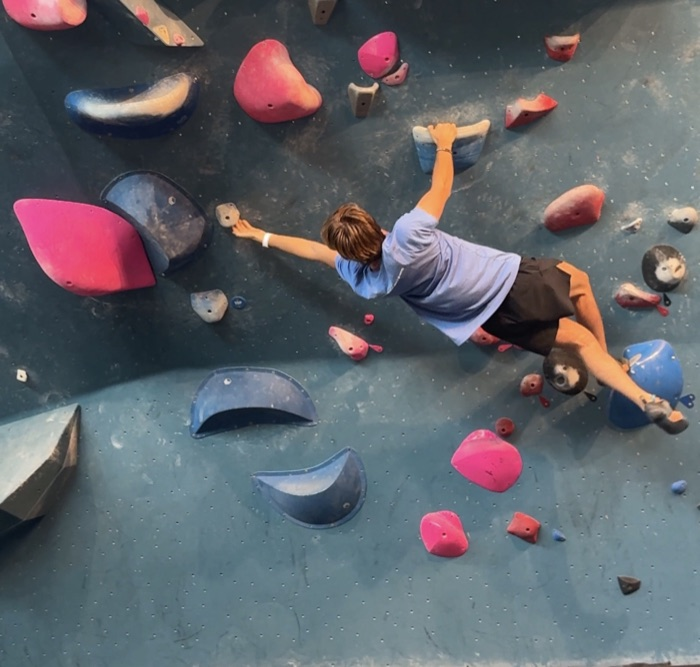
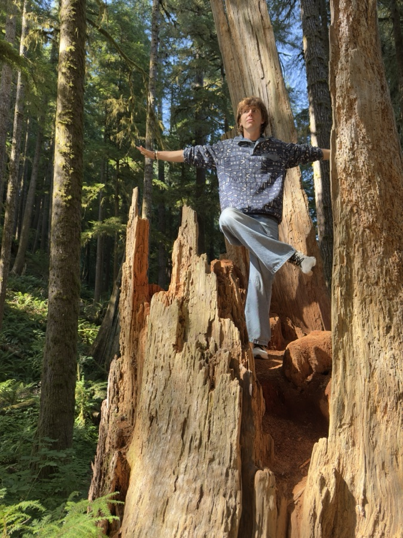

# Hello! I'm Leo

### BS/MS student at RIT finishing both degrees in 4.5 years (my last semester will be 3 credits online)

### BS Software Engineering (May 2027) and MS Computer Science (December 2027)

### Open to: Summer 2027 MS internships and full-time roles starting May 2027

## Work experience

- **Elsevier**, AI Optimization Intern (June 2026 to August 2026): built an on-device LLM review tool and the citation pipeline behind it, helping support content get found and cited by AI search engines

- **Sorenson Communications**, AI Scientist Intern (June 2025 to November 2025): built the debugger for production sign language translation models and worked directly with the recognition models

- **Ballista Technology Group** ***(high school)***, DevOps Engineer Intern (May 2022 to August 2022): automated Docker builds and Kubernetes deployments on AWS and Azure, with CI on every push

- **Pratexo** ***(high school)***, Software Engineering Intern (June 2021 to August 2021): built a mobile object detection prototype for K9 search and rescue, from Raspberry Pi to Google Coral Edge TPU

- **RIT**, Teaching Assistant, Embedded Systems (September 2025 to May 2026): TA for two systems courses, including graduate Real-Time and Embedded Systems

## Projects

- [**Ada**](https://github.com/machmoon/Ada): an AI hardware engineer that turns a plain-language spec into a manufacturable circuit board, where I built the retrieval layer and fabrication-order path on a hackathon team

- [**Touchalytics**](https://github.com/leopozh/touchalytics): an Android app that recognizes you by how you swipe through a feed of cat photos

- [**BERT Bouncer**](https://github.com/leopozh/bert-bouncer): an on-device prompt-injection firewall for Claude Code

- [**Volatility**](https://github.com/leopozh/volatility-oss): a local-first platform for backtesting trading strategies

<table>
  <tr>
    <td align="center" width="50%"> Ada</td>
    <td align="center" width="50%"> Touchalytics</td>
  </tr>
  <tr>
    <td align="center" width="50%"> BERT Bouncer</td>
    <td align="center" width="50%"> Volatility</td>
  </tr>
</table>

## Open source

- [**Google JAX**](https://github.com/jax-ml/jax/pull/38287): device-mesh factorization fix, plus an [istft edge-case fix](https://github.com/jax-ml/jax/pull/38319)

- [**Lightning AI TorchMetrics**](https://github.com/Lightning-AI/torchmetrics/pull/3406): top-k validation fix for multiclass metrics

- [**Roblox FAI-RL**](https://github.com/Roblox/FAI-RL/pull/91): import fix that made the test suite runnable, merged

## Hobbies

Varsity swimming (50 free, 100 free), scuba diving, rock climbing, hiking, hackathons

  
  
  

## Contact me

leo@pozhenko.com, 650-550-0212, [linkedin.com/in/leopoz](https://linkedin.com/in/leopoz)

